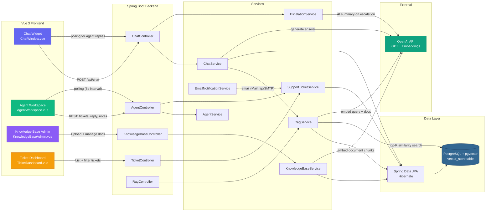
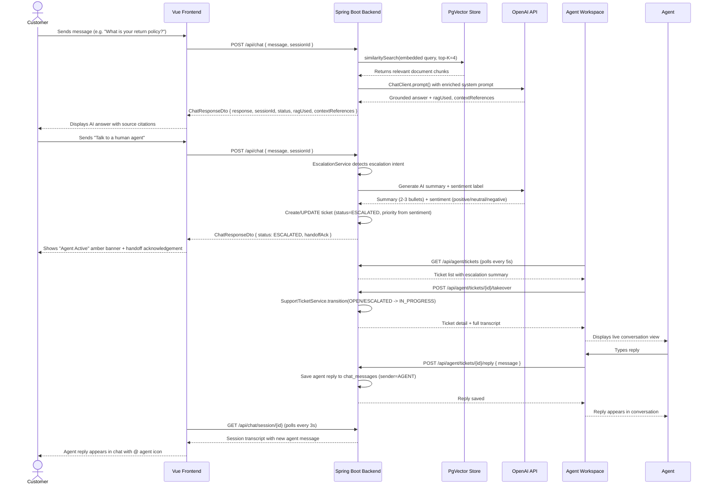

# AI Customer Support Chatbot

[](https://github.com/niyonkuruarnold/ai-customer-support-chatbot/actions)
[](https://github.com/niyonkuruarnold/ai-customer-support-chatbot/actions/workflows/ci.yml)

An intelligent customer support chatbot system built with Spring Boot 3.3+, PostgreSQL, and Spring AI. Features RAG (Retrieval-Augmented Generation) knowledge base retrieval, automated ticketing, and human agent escalation.

**[📄 View Full Project Proposal](./doc/CODAFRIQA_AI_Chatbot_Proposal.pdf) | [📊 Week 2 Architecture](./doc/WEEK-2-ARCHITECTURE.md)**

---

## Architecture Diagram



> **Legend:** Solid arrows = synchronous HTTP calls. Dashed arrows = email delivery via Mailtrap/SMTP. Polling arrows = periodic refresh (chat: 3s, agent: 5s).

---

## Escalation Sequence Diagram

The following Mermaid sequence diagram illustrates the complete flow from a customer requesting human help through to a live agent taking over the conversation.



---

## Feature Breakdown

| Feature | Description | Technology | Key Endpoints / Files |
|---------|-------------|------------|----------------------|
| **RAG Context Ingestion** | Ingest `.txt`, `.md`, `.pdf` documents into a vector store for retrieval-augmented generation. Documents are chunked (~500 tokens), embedded with OpenAI `text-embedding-3-small` (1536-dim), and stored in pgvector. Top-K (4) relevant chunks are retrieved per user query and injected into the system prompt. | Spring AI, pgvector, OpenAI Embeddings, `TokenTextSplitter` | `POST /api/v1/rag/ingest`, `RagService.java`, `KnowledgeBaseService.java`, `vector_store` table |
| **Live Agent Takeover (Polling)** | When the AI cannot resolve an issue, the customer triggers escalation. The backend generates an AI handoff summary + sentiment, pauses automated responses, and the agent workspace displays a live ticket queue refreshed via 5-second polling. Agent replies are saved directly to the customer transcript. | Spring AI (summary), Polling (5s), `EscalationService`, `AgentService` | `POST /api/chat` (escalation), `POST /api/agent/tickets/{id}/takeover`, `AgentWorkspace.vue` |
| **Basic-Auth Security** | Spring Security with HTTP Basic Authentication protects agent and admin endpoints. Customer-facing chat endpoints remain public. Credentials seeded on boot via `DataInitializer` (default: `admin` / `admin123`). | Spring Security, `SecurityConfig.java`, `UserDetailsService` | `GET /api/agent/**`, `GET /api/v1/admin/**`, `POST /api/v1/tickets/**` |
| **GitHub Actions CI** | Automated CI pipeline runs on every push/PR: backend tests (Java 21, Maven, PostgreSQL service container with pgvector) and frontend tests (Node 20, Vitest). JaCoCo coverage reports are generated, uploaded as artifacts, and summarized in the workflow run. | GitHub Actions, JaCoCo 0.8.12, pgvector/pgvector:pg17 | `.github/workflows/ci.yml` |

---

## Key Features

### 🧠 RAG (Retrieval-Augmented Generation) Pipeline

The chatbot answers questions grounded in your own knowledge base, not just generic AI responses.

```
User Question
     |
     v
+---------------------------------------------+
|  1. EMBED QUERY                             |
|     OpenAI text-embedding-3-small           |
|     -> 1536-dim vector                      |
+----------------------+----------------------+
                       |
                       v
+---------------------------------------------+
|  2. SIMILARITY SEARCH                       |
|     pgvector: top-K nearest chunks          |
|     from vector_store table                 |
+----------------------+----------------------+
                       |
                       v
+---------------------------------------------+
|  3. PROMPT ENRICHMENT                       |
|     Retrieved chunks injected into          |
|     system prompt + source metadata         |
|     (doc id, title, type)                   |
+----------------------+----------------------+
                       |
                       v
+---------------------------------------------+
|  4. ANSWER GENERATION                       |
|     OpenAI GPT generates grounded response  |
|     Response includes ragUsed +             |
|     contextReferences                       |
+---------------------------------------------+
```

**Ingestion pipeline:** Documents (`.txt`, `.md`, `.pdf`) -> Spring AI `DocumentReader` -> `TokenTextSplitter` (~500-token chunks) -> OpenAI embedding -> pgvector `vector_store` table. Chunks are tracked in `knowledge_documents` / `knowledge_chunks` metadata tables for admin management.

**Key behaviors:**
- Graceful fallback: missing `OPENAI_API_KEY` -> chat answers without KB context (retrieval logs the error, falls back to plain prompt)
- Embedding failures -> 400 + rollback (no partial documents)
- Responses carry `ragUsed` boolean + `contextReferences[]` for frontend citations

### 🎧 Real-Time Agent Handoff

When the AI can't help, a human agent takes over — seamlessly.

1. **Escalation trigger:** Customer sends *"Talk to a human agent"* -> `EscalationService` detects the intent
2. **AI summary:** Spring AI generates 2-3 bullet summary + sentiment label -> priority auto-derived from sentiment
3. **AI pauses:** Once `ESCALATED`, the backend stops generating AI answers — customer messages get *"sent to the agent"* acknowledgement
4. **Agent takes over:** Agent workspace shows live ticket queue (polled every 5s) -> agent clicks "Take over" -> replies are saved directly to the customer's transcript
5. **Customer sees live updates:** Customer chat polls the backend -> new agent messages appear in real-time, UI shows amber **Agent Active** banner

**Agent Workspace features:**
- Live ticket queue with status/priority/sentiment badges
- Pinned AI Handoff Summary
- Real-time conversation view (auto-refreshes via polling)
- Internal notes (visible only to agents)
- Customer contact details (email from backing account)

### 🎫 Ticket Lifecycle Management

Automated ticket creation, routing, and email notifications powered by a state machine.

```
         +----------+
         |   OPEN   | <-- Created on chat session start
         +----+-----+
              | agent takes over
              v
      +---------------+
      |  IN_PROGRESS  |
      +-------+-------+
              | agent resolves
              v
      +-----------+
      |  RESOLVED | <-- Email: "Your ticket has been resolved"
      +-----+-----+
            | admin closes
            v
      +--------+
      | CLOSED |
      +--------+

  Any state --> ESCALATED (on "talk to a human" trigger)
  Invalid transitions -> 400 "Invalid ticket status transition"
```

**Email notifications** (via JavaMailSender + Mailtrap/SMTP):
- **Opened:** Ticket created (includes escalation)
- **Updated:** Agent takes over
- **Resolved:** Ticket resolved

Without SMTP credentials the app boots and send failures are logged as warnings — never breaks ticket operations.

---

## Screenshots

### 💬 Chat Widget

> *The customer-facing chat interface with collapsible widget, AI message bubbles, and inline source citations from the knowledge base.*

<!-- Replace the placeholder below with an actual screenshot -->

```
+-------------------------------------+
|  AI Customer Support          [-]  |
|  * Online - replies instantly       |
|-------------------------------------|
|                                     |
|  * Ask us anything - orders,       |
|     refunds, shipping...            |
|                                     |
|  :) What's your return policy?      |
|                                     |
|  8) Based on our Returns Policy:   |
|     You may return items within     |
|     30 days of delivery.            |
|     [Returns Policy]                |
|                                     |
|  +----------------------+  [>]     |
|  | Type your message... |          |
|  +----------------------+          |
+-------------------------------------+
```


### 🎧 Agent Workspace

> *The agent-facing workspace showing the live ticket queue, AI handoff summary, real-time conversation, and internal notes.*

```
+-----------------------------------------------------+
|  Agent Workspace                      [Logout]      |
|-----------------------------------------------------|
| + Tickets ----------+  + Conversation ------------+|
| | o #12 OPEN        |  | 8 AI Summary:            ||
| |   Sentiment: :(   |  | * Customer frustrated     ||
| |   Priority: HIGH  |  |   with delayed shipment   ||
| |   Last: "I'm      |  | * Needs tracking info     ||
| |   furious"        |  |                           ||
| |                   |  | ^ "Where is my order?!"    ||
| | # #11 IN_PROGRESS |  | 8 "Sent to the agent"     ||
| |                   |  | @ "Hi, let me check..."   ||
| +-------------------+  |                           ||
|                        | [Internal Notes]          ||
| + Status ------------+ | * Customer since 2024     ||
| | * Agent Active     | | * Previous issue resolved ||
| |   AI paused        | |                           ||
| +--------------------+ | [Reply] [Resolve] [Notes] ||
|                        +---------------------------+|
+-----------------------------------------------------+
```


### 📚 Knowledge Base Admin

> *The admin interface for uploading support documents, managing the indexed knowledge base, and triggering embedding generation.*

```
+-----------------------------------------------------+
|  Knowledge Base Admin                   [Logout]    |
|-----------------------------------------------------|
|                                                     |
|  + Upload Document -------------------------------+ |
|  |  [o] Drag & drop .txt / .md / .pdf here       | |
|  |  --- or paste text below ---                   | |
|  |  [Title: Returns Policy        ]               | |
|  |  [Content: Customers may return...]            | |
|  |  [Upload Text]  [Upload File]                  | |
|  +-----------------------------------------------+ |
|                                                     |
|  + Indexed Documents -----------------------------+ |
|  |  Returns Policy      TEXT   12 chunks (ok)     | |
|  |  Shipping FAQ        MD      8 chunks (ok)     | |
|  |  Product Catalog    PDF    45 chunks (ok)      | |
|  |                                   [Delete]     | |
|  +-----------------------------------------------+ |
|                                                     |
|  Embeddings: 1536-dim (text-embedding-3-small)      |
|  Vector store: pgvector                             |
+-----------------------------------------------------+
```


> **Note:** To add screenshots, place PNG files in `doc/screenshots/` and update the image paths above.

---

## Project Status

### Week 2: Complete
- Database schema design (4 tables: users, chat_sessions, chat_messages, support_tickets)
- JPA entity models with Hibernate annotations
- Spring Data JPA repositories
- PostgreSQL + pgvector integration
- Basic REST API controllers (User, Chat, Test endpoints)
- DTO layer for API request/response handling

### Week 3: RAG Pipeline
- **pgvector configuration**: `spring.ai.vectorstore.pgvector.initialize-schema=true` (schema auto-created on boot) and 1536-dimension embeddings (OpenAI `text-embedding-3-small`)
- **`RagService`**: dedicated RAG service injecting the pgvector `VectorStore` + `ChatClient.Builder` — ingestion and `retrieveContext` (top-K similarity search, never throws, falls back to a plain prompt)
- **Ingestion endpoint**: `POST /api/v1/rag/ingest` — without `OPENAI_API_KEY` it fails fast with a structured 400 and rolls back cleanly
- **Context-aware chat**: each customer message runs a vector similarity search (top-4 chunks), the retrieved context is injected into the OpenAI system prompt, and the response carries **`ragUsed` + `contextReferences`** for citation metadata

### Week 4: Knowledge Base & RAG
- Document ingestion pipeline: text, Markdown and PDF support documents parsed with Spring AI document readers
- Token-based chunking with Spring AI `TokenTextSplitter`, embedded and stored in PostgreSQL via the pgvector `VectorStore`
- Admin knowledge base endpoints: upload, list documents/chunks, delete
- Vue **Knowledge Base** tab in the Agent Workspace: drag-and-drop upload, paste raw FAQ text, list/index/delete documents

### Week 5: Human Handoff & Agent Workspace
- Escalation detection (e.g. "Talk to a human agent") -> session/ticket status ESCALATED
- AI handoff summary (2-3 bullets + sentiment) generated with Spring AI on escalation; priority derived from sentiment
- Chat sessions persisted to PostgreSQL (transcript available to agents)
- Agent REST endpoints: ticket queue, takeover, reply, internal notes, resolve
- Vue agent workspace (togglable Agent Mode / `?mode=agent`): **live ticket queue** (polled every 5s)
- **AI pause on handoff:** once a session is ESCALATED, the backend stops generating AI answers

### Week 6: Ticket Lifecycle & Email Notifications
- **Dedicated Knowledge Base Admin page** (`?mode=knowledge`): drag-and-drop `.md`/`.txt` upload, indexed-documents table with delete
- `SupportTicketService` state machine: OPEN -> IN_PROGRESS -> RESOLVED -> CLOSED (ESCALATED accepted for handoff)
- Automated email notifications via `JavaMailSender` (Mailtrap-style SMTP) on ticket **opened / updated / resolved**

## Tech Stack

| Layer | Technology |
|-------|-----------|
| **Frontend** | Vue 3 (Composition API), Pinia, Tailwind CSS, Vite |
| **Backend** | Spring Boot 3.3+, Spring Security, Spring Data JPA |
| **Database** | PostgreSQL 15+ with pgvector extension |
| **AI/ML** | Spring AI, OpenAI GPT-4, text-embedding-3-small (1536-dim) |
| **Build** | Maven 3.8+, Node.js 20 |
| **Container** | Docker & Docker Compose |
| **CI/CD** | GitHub Actions (Java 21 + Node 20) |
| **Java** | OpenJDK 17+ |

## Core Components

### Database Layer

| Table | Purpose | Key Fields |
|-------|---------|-----------|
| `users` | User accounts & auth | id, email, role, created_at |
| `chat_sessions` | Chat context tracking | id, user_id, status, created_at |
| `chat_messages` | Message history & embeddings | id, session_id, sender, content, embedding |
| `support_tickets` | Escalated issues | id, user_id, subject, priority, status |
| `knowledge_documents` | KB documents (RAG) | id, title, source_type, file_name |
| `knowledge_chunks` | KB chunks mirroring pgvector rows | id, document_id, chunk_index, content |
| `vector_store` | pgvector embeddings (Spring AI) | id, content, embedding, metadata |

### Service Layer

| Service | Responsibility |
|---------|---------------|
| `ChatService` | RAG-powered chat — retrieves top-K KB chunks, enriches prompt, generates answer |
| `RagService` | Vector ingestion + similarity search — dedicated RAG orchestration |
| `KnowledgeBaseService` | Document pipeline — readers -> chunking -> embedding -> pgvector storage |
| `EscalationService` | Escalation detection + AI summary generation on handoff |
| `AgentService` | Agent workspace operations — ticket queue, takeover, reply, notes |
| `SupportTicketService` | Ticket state machine (OPEN -> IN_PROGRESS -> RESOLVED -> CLOSED) |
| `EmailNotificationService` | Automated ticket emails via JavaMailSender + Mailtrap/SMTP |
| `UserService` | User authentication and management |

### API Endpoints

<details>
<summary><b>User Management</b></summary>

```
POST   /api/users/register       - Register new user
POST   /api/users/login          - User authentication
GET    /api/users/{id}           - Get user profile
```
</details>

<details>
<summary><b>Chat</b></summary>

```
POST   /api/chat                 - Send message { message, sessionId? } -> { response, sessionId, status }
GET    /api/chat/session/{id}    - Session status + transcript (restores history, picks up agent replies)
GET    /api/chat/health          - Health check
```
</details>

<details>
<summary><b>Agent Workspace</b> (requires Basic auth — default admin/admin123)</summary>

```
GET    /api/agent/tickets                  - List escalated/open/in-progress tickets
GET    /api/agent/tickets/{id}             - Ticket detail (transcript + internal notes)
POST   /api/agent/tickets/{id}/takeover    - Assign ticket to current agent
POST   /api/agent/tickets/{id}/reply       - Send agent reply { message }
POST   /api/agent/tickets/{id}/notes       - Add internal note { content }
POST   /api/agent/tickets/{id}/resolve     - Resolve ticket
```
</details>

<details>
<summary><b>Ticket Lifecycle Dashboard</b> (requires Basic auth — default admin/admin123)</summary>

```
GET    /api/v1/tickets                 - List tickets (filters: status, priority, assignedAgentId; page=0-based, size, sort)
POST   /api/v1/tickets/{id}/close      - Close a resolved ticket (RESOLVED -> CLOSED)

# Examples
GET    /api/v1/tickets?status=ESCALATED&priority=HIGH&page=0&size=10&sort=updatedAt,desc
GET    /api/v1/tickets?assignedAgentId=1
```
</details>

<details>
<summary><b>Knowledge Base</b> (requires Basic auth — default admin/admin123)</summary>

```
POST   /api/v1/admin/knowledge-base/upload   - Upload + index a support file (multipart: file, optional title)
GET    /api/v1/admin/knowledge-base          - List indexed documents (with chunk counts)
DELETE /api/v1/admin/knowledge-base/{id}     - Remove document + its chunks from the vector store

# Equivalent paths on the documents namespace (used by the Vue KB tab):
POST   /api/admin/documents/upload           - Upload + index a support file (multipart: file, optional title)
POST   /api/admin/documents/text             - Index pasted FAQ text { title, content }
GET    /api/admin/documents                  - List indexed documents (with chunk counts)
GET    /api/admin/documents/chunks           - List every indexed chunk
DELETE /api/admin/documents/{id}             - Remove document + its chunks from the vector store
```
</details>

<details>
<summary><b>Health Checks</b></summary>

```
GET    /test/health              - Server health status
GET    /test/db-status           - Database connection check
```
</details>

## Quick Start

### Prerequisites

```bash
java -version          # Requires Java 17+
mvn --version          # Requires Maven 3.8+
docker --version
node -v                # Requires Node.js 20+ (for frontend)
```

### 1. Clone & Navigate

```bash
git clone https://github.com/niyonkuruarnold/ai-customer-support-chatbot.git
cd ai-customer-support-chatbot
```

### 2. Start PostgreSQL Container

```bash
docker-compose up -d
```

### 3. Enable pgvector Extension

```bash
docker exec -it chatbot_postgres psql -U postgres -d ai_customer_support_chatbot \
  -c "CREATE EXTENSION IF NOT EXISTS vector;"
```

### 4. Configure Environment

```bash
cp .env.example .env
# Edit .env and add your OPENAI_API_KEY
```

### 5. Build & Run Backend

```bash
mvn clean compile
mvn spring-boot:run
```

### 6. Verify Backend

```bash
curl http://localhost:8080/test/health
curl http://localhost:8080/test/db-status
```

### 7. Run Frontend (Development)

```bash
cd frontend
npm install
npm run dev
```

The frontend is available at `http://localhost:5173`.

### Environment Configuration

Edit `src/main/resources/application.properties`:

```properties
# Database
spring.datasource.url=jdbc:postgresql://127.0.0.1:5432/ai_customer_support_chatbot
spring.datasource.username=postgres
spring.datasource.password=postgres

# OpenAI (for RAG + AI responses)
spring.ai.openai.api-key=${OPENAI_API_KEY}

# Server
server.port=8080
```

### Environment Variables Reference

| Variable | Required | Default | Description |
|----------|----------|---------|-------------|
| `OPENAI_API_KEY` | Yes (for RAG) | *(empty)* | OpenAI API key for GPT-4 chat completions and `text-embedding-3-small` vector embeddings. Without it, chat falls back to a plain prompt and KB uploads fail with a 400. |
| `SPRING_DATASOURCE_URL` | No | `jdbc:postgresql://127.0.0.1:5432/ai_customer_support_chatbot` | PostgreSQL JDBC connection URL. Points to the Docker container by default. |
| `SPRING_DATASOURCE_USERNAME` | No | `postgres` | Database username. |
| `SPRING_DATASOURCE_PASSWORD` | No | `postgres` | Database password. |
| `SPRING_AI_VECTORSTORE_PGVECTOR_INITIALIZE-SCHEMA` | No | `true` | Auto-create the pgvector `vector_store` table on boot (Spring AI M6 default). |
| `SPRING_AI_OPENAI_API_KEY` | No | *(same as OPENAI_API_KEY)* | Explicit Spring AI property for the OpenAI key. Falls back to `OPENAI_API_KEY` via placeholder resolution. |
| `MAIL_HOST` | No | *(empty)* | SMTP host for ticket email notifications (e.g. `smtp.mailtrap.io`). Without it, emails are skipped gracefully. |
| `MAIL_PORT` | No | *(empty)* | SMTP port (e.g. `2525`). |
| `MAIL_USERNAME` | No | *(empty)* | SMTP username. |
| `MAIL_PASSWORD` | No | *(empty)* | SMTP password. |
| `MAIL_FROM` | No | *(empty)* | Sender email address for notifications. |

> **Tip:** Copy `.env.example` to `.env` and fill in your values. The `spring-dotenv` dependency loads `.env` automatically — real environment variables always win over `.env` values.

> **Set the OpenAI key before starting the app.** The property is the
> placeholder `${OPENAI_API_KEY:}` (empty default), read from the process
> environment **or a local `.env` file** (via the `spring-dotenv` dependency —
> real environment variables always win over `.env`). Copy the template and
> fill it in:
>
> ```bash
> cp .env.example .env      # then edit .env with your real key
> mvn spring-boot:run
> ```
>
> Or export it in your terminal instead:
>
> ```bash
> # Linux/macOS/Git Bash
> export OPENAI_API_KEY=sk-...
> mvn spring-boot:run
>
> # Windows (PowerShell)
> $env:OPENAI_API_KEY = "sk-..."; mvn spring-boot:run
> ```
>
> `.env` is gitignored (only `.env.example` is committed), so secrets never
> reach git. At startup the app logs `OpenAI API key is configured (N
> characters)` on success or a clear `OpenAI API key is NOT configured`
> warning otherwise.
>
> **Two config flavors** (pick one in `application.properties`):
> - `${OPENAI_API_KEY}` (default) — the placeholder stays unresolved without
>   a key, the app boots and degrades gracefully: chat answers with the
>   fallback message and knowledge base uploads fail with a 400 "Could not
>   generate embeddings" (rolled back cleanly). The exact failure is logged
>   with its full stack trace — look for `Caused by: HttpRetryException ...
>   server authentication` in the app log. A missing or placeholder key is
>   never an unhandled exception.
> - `${OPENAI_API_KEY:}` — resolves to empty when the variable is missing,
>   and Spring AI M6 then **fails fast at boot** with "OpenAI API key must be
>   set". Use this when a key (`.env` or exported) is always expected.
>
> **Email (ticket notifications):** add `MAIL_HOST`, `MAIL_PORT`,
> `MAIL_USERNAME`, `MAIL_PASSWORD`, `MAIL_FROM` to `.env` (see
> `.env.example`) to receive real ticket emails via Mailtrap/SMTP. Without
> them the app boots and send attempts fail gracefully (warnings in the log).

## Development Workflow

### Build

```bash
mvn clean compile        # Backend
cd frontend && npm run build  # Frontend
```

### Test

```bash
mvn test                 # Backend (20 tests)
cd frontend && npm test  # Frontend (102 tests)
```

### Run Locally

```bash
# Start backend (creates tables automatically)
mvn spring-boot:run

# In a separate terminal - start frontend dev server
cd frontend && npm run dev
```

### Database Access

```bash
# Connect to PostgreSQL
docker exec -it chatbot_postgres psql -U postgres -d ai_customer_support_chatbot

# List tables
\dt

# Query users
SELECT * FROM users;
SELECT * FROM chat_sessions;
```

### Docker Logs

```bash
docker logs chatbot_postgres -f
```

## Project Structure

```
ai-customer-support-chatbot/
+-- src/main/java/com/codafriqa/ai_customer_support_chatbot/
|   +-- AiCustomerSupportChatbotApplication.java    # Spring Boot entry point
|   +-- config/
|   |   +-- SecurityConfig.java                     # Spring Security config
|   |   +-- DataInitializer.java                    # Seeds default accounts
|   +-- controller/                                  # REST endpoints
|   |   +-- UserController.java
|   |   +-- ChatController.java
|   |   +-- AgentController.java
|   |   +-- AdminController.java
|   |   +-- KnowledgeBaseController.java
|   |   +-- RagController.java
|   |   +-- TicketController.java
|   |   +-- TestController.java
|   +-- dto/                                         # API data transfer objects
|   +-- exception/                                   # Global exception handler
|   +-- model/                                       # JPA entities
|   +-- repository/                                  # Spring Data JPA repos
|   +-- service/                                     # Business logic
|       +-- ChatService.java                         # RAG-powered chat
|       +-- RagService.java                          # Vector store + retrieval
|       +-- KnowledgeBaseService.java                # Document ingestion pipeline
|       +-- EscalationService.java                   # Human handoff detection
|       +-- AgentService.java                        # Agent workspace operations
|       +-- SupportTicketService.java                # Ticket lifecycle state machine
|       +-- EmailNotificationService.java            # Ticket email notifications
|       +-- UserService.java                         # User auth & management
+-- frontend/
|   +-- src/
|   |   +-- api/                                     # Axios API clients
|   |   +-- components/
|   |   |   +-- ChatWindow.vue                       # Customer chat widget
|   |   |   +-- ChatMessage.vue                      # Message bubble component
|   |   |   +-- TypingIndicator.vue                  # Loading indicator
|   |   |   +-- agent/                               # Agent workspace views
|   |   |   |   +-- AgentWorkspace.vue
|   |   |   |   +-- AgentTicketList.vue
|   |   |   |   +-- AgentConversation.vue
|   |   |   +-- admin/                               # Admin views
|   |   |       +-- KnowledgeBaseAdmin.vue
|   |   |       +-- KnowledgeBaseManager.vue
|   |   |       +-- TicketDashboard.vue
|   |   +-- stores/                                  # Pinia stores
|   |   |   +-- chat.js
|   |   |   +-- agent.js
|   |   |   +-- knowledgeBase.js
|   |   +-- utils/
|   |       +-- markdown.js                          # Markdown rendering
|   +-- package.json
|   +-- vite.config.js
+-- docker-compose.yml                               # PostgreSQL + pgvector
+-- pom.xml                                          # Maven dependencies
+-- README.md                                        # This file
```

## Key Dependencies

See `pom.xml` for the full list. Key libraries:

| Dependency | Purpose |
|-----------|---------|
| `spring-boot-starter-web` | REST API support |
| `spring-boot-starter-data-jpa` | ORM and data access |
| `spring-boot-starter-security` | Authentication & authorization |
| `spring-boot-starter-mail` | Email notifications |
| `spring-ai-openai-spring-boot-starter` | OpenAI GPT + embeddings |
| `spring-ai-pgvector-store-spring-boot-starter` | pgvector vector store |
| `spring-ai-markdown-document-reader` | Markdown document parsing |
| `spring-ai-pdf-document-reader` | PDF document parsing |
| `postgresql` | PostgreSQL JDBC driver |
| `springboot3-dotenv` | `.env` file loading |

**Frontend:** `vue@3`, `pinia`, `tailwindcss`, `vite`, `vitest`, `axios`, `markdown-it`

## Testing

```bash
# Backend - unit tests (Mockito) + integration tests
mvn test

# Frontend - unit tests (Vitest + jsdom)
cd frontend && npm test

# Full build verification
mvn clean verify && cd frontend && npm ci && npm run build && npm test
```

## Code Coverage

This project uses [JaCoCo](https://www.jacoco.org/) (v0.8.12) for automated code coverage reporting. The Maven plugin instruments bytecode during test execution and generates HTML/XML/CSV reports.

### Generating Reports Locally

```bash
# Run tests + generate coverage report
mvn clean test

# Open the HTML report in your browser
# target/site/jacoco/index.html
```

### CI Coverage Artifacts

Every CI run on `main` and pull requests:
1. Generates the full JaCoCo HTML report
2. Uploads it as the `jacoco-coverage-report` artifact (retained 30 days)
3. Parses `jacoco.xml` to extract line-coverage % and writes it to the GitHub Actions step summary
4. Generates an SVG badge (uploaded as `coverage-badge` artifact)

### Coverage Report Contents

| Format | Path | Description |
|--------|------|-------------|
| **HTML** | `target/site/jacoco/index.html` | Visual drill-down by package/class/method |
| **XML** | `target/site/jacoco/jacoco.xml` | Machine-readable; used by CI to compute % |
| **CSV** | `target/site/jacoco/jacoco.csv` | Tabular per-class coverage data |

### CI Coverage Summary

The workflow parses the JaCoCo XML summary and outputs a summary like:

```
## JaCoCo Coverage
**Line coverage: XX%**
```

A coverage badge (green/yellow/red based on thresholds: >=80% green, >=60% yellow, <60% red) is generated and uploaded as a downloadable artifact.

### Manual Testing with curl

```bash
# Register user
curl -X POST http://localhost:8080/api/users/register \
  -H "Content-Type: application/json" \
  -d '{"email":"user@example.com","password":"pass123","role":"CUSTOMER"}'

# Create chat session
curl -X POST http://localhost:8080/api/chat/session \
  -H "Content-Type: application/json" \
  -d '{"userId":1}'

# Send chat message
curl -X POST http://localhost:8080/api/chat \
  -H "Content-Type: application/json" \
  -d '{"message":"What is your return policy?"}'

# Ingest knowledge base document
curl -X POST http://localhost:8080/api/v1/rag/ingest \
  -H "Content-Type: application/json" \
  -d '{"title":"Returns Policy","content":"Customers may return items within 30 days of delivery."}'
```

## Troubleshooting

<details>
<summary><b>PostgreSQL Connection Issues</b></summary>

```bash
docker ps | grep chatbot_postgres
docker logs chatbot_postgres
docker-compose restart chatbot_postgres
```
</details>

<details>
<summary><b>Java Build Issues</b></summary>

```bash
rm -r ~/.m2/repository
mvn clean install -DskipTests
```
</details>

<details>
<summary><b>Port Already in Use</b></summary>

```bash
netstat -ano | findstr :8080
taskkill /PID <PID> /F
```
</details>

<details>
<summary><b>Frontend Issues</b></summary>

```bash
cd frontend
rm -rf node_modules
npm install
npm run dev
```
</details>

## Contributing

1. Create feature branch: `git checkout -b feature/description`
2. Make changes and commit: `git commit -m "feat(scope): description"`
3. Push to branch: `git push origin feature/description`
4. Create Pull Request

## License

Proprietary - CODAFRIQA AI

---

## Appendix: Detailed Flows

### Knowledge Base (RAG) Flow

1. Sign in to the **Agent Workspace** (`admin` / `admin123`) and open the **Knowledge Base** tab.
2. Drag-and-drop a `.txt`/`.md`/`.pdf` support document or paste raw FAQ text with a title.
3. The backend parses the source with Spring AI document readers, splits it into ~500-token chunks with `TokenTextSplitter`, embeds each chunk, and stores it in the pgvector `vector_store` table.
4. Each customer message now retrieves the top-K relevant chunks and the prompt is enriched with that context.

Programmatic ingestion is also available:

```bash
curl -X POST http://localhost:8080/api/v1/rag/ingest \
  -H "Content-Type: application/json" \
  -d '{"title": "Returns Policy", "content": "Customers may return items within 30 days..."}'
```

Chat responses include RAG metadata — `ragUsed` (whether the answer was grounded in retrieved context) and `contextReferences` (the source document id / title / type per retrieved chunk), which the frontend can render as citations.

> **Note:** embedding generation requires `OPENAI_API_KEY`. Without a key, uploads fail fast with a clear 400 (and roll back cleanly), and the chat gracefully answers without KB context.

### Human Handoff Flow

1. Customer sends a trigger like *"Talk to a human agent"* in the chat UI.
2. The backend marks the session ESCALATED, creates/updates the support ticket, and asks Spring AI to summarize the transcript into 2-3 bullet points with a sentiment label.
3. Open **Agent Workspace** (`?mode=agent`) and sign in with Spring Security credentials (`admin` / `admin123`).
4. Pick the escalated ticket — the queue shows the customer's contact, sentiment and priority badges, the AI handoff summary snippet. Click **Take over**, then reply.
5. The workspace **polls every 5s** — newly escalated tickets appear and new customer messages show up automatically.
6. Once escalated, **automated AI responses are paused** — the customer UI shows an amber **Agent Active** banner.

### Ticket Lifecycle & Email Notifications

- **State machine:** `SupportTicketService` owns all status transitions — OPEN -> IN_PROGRESS (takeover), OPEN/ESCALATED/IN_PROGRESS -> RESOLVED, RESOLVED -> CLOSED. Invalid transitions return a structured **400**.
- **Emails:** on ticket **opened** (creation, incl. escalation), **updated** (agent takeover), and **resolved**, `EmailNotificationService` sends a styled HTML + plain-text email via `JavaMailSender`. Without credentials the app still boots and send failures are logged as warnings.

## Next Steps

- [ ] Streaming message API
- [ ] Integration tests with Testcontainers
- [ ] API documentation (OpenAPI/Swagger)
- [ ] WebSocket-based real-time updates (replace polling)
- [ ] Multi-document ingestion from external sources (URLs, S3, etc.)
- [ ] Embedding batching/retry tuning for large PDFs

---

**Last Updated:** Week 6 Complete (August 2026)
**Maintainer:** CODAFRIQA Development Team
